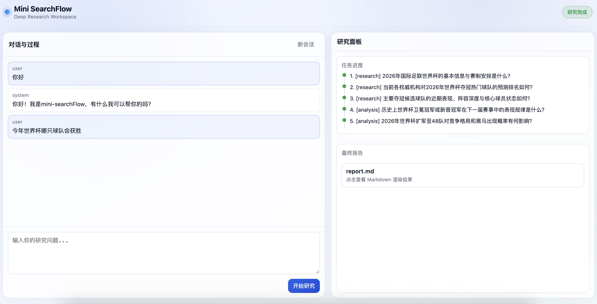
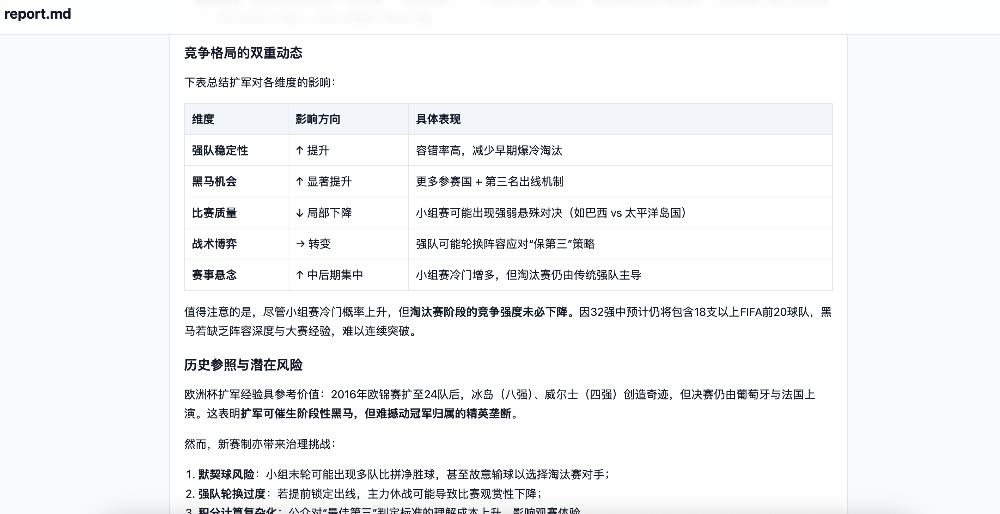

# 🔎 Mini-SearchFlow

Mini-SearchFlow 是一个基于 LangGraph/LangChain 的多智能体 Deep Research 工作流原型，参考 deer-flow 的结构，并在流程上做了简化和改造，适合用于研究型问答、资料汇总与报告生成。

## Demo Screenshots
### 前端工作台


### 报告展示


## Features
- **模块化工作流**：Coordinator → Background Investigator → Question Decomposer → Human Feedback → Research Team → Reporter
- **可交互的 Human Feedback**：支持 `interrupt/resume`，对拆分子问题进行人工审阅与修订
- **多角色研究团队**：researcher / analyst / coder 根据子问题类型选择执行
- **报告自动落盘**：最终报告保存到 `outputs/` 目录
- **可扩展检索与 RAG**：支持 Tavily 搜索 + 预留多种 RAG provider
- **Prompt 模板化**：基于 Jinja2 的统一 Prompt 结构

## Workflow Overview
1. **Coordinator**：判断问题复杂度，决定直接回答或进入深度研究
2. **Background Investigator**：背景检索，提供初始上下文
3. **Question Decomposer**：将原问题拆分为可执行子问题，并标注类型
4. **Human Feedback**：人工确认/修改子问题
5. **Research Team**：逐个执行子问题（research/analysis/processing）
6. **Reporter**：聚合答案并生成最终报告，保存到 `outputs/`

## Project Structure
```
mini-searchflow/
  agents/           # Agent 创建与中间件
  citations/        # 引文解析与格式化
  config/           # 配置与 LLM/工具映射
  crawler/          # 网页抓取工具
  graph/            # LangGraph 节点与图构建
  llms/             # 模型封装与 provider
  prompt/           # Prompt 模板与 schema
  rag/              # RAG 组件与向量库接口
  tools/            # 搜索、爬虫、RAG、Python REPL
  utils/            # 通用工具
  web/              # 轻量前端页面（HTML/CSS/JS）
  outputs/          # 报告输出目录
  runflow.py        # 交互运行入口
  server.py         # FastAPI + SSE 服务入口
```

## Quick Start
### 1) 安装依赖
```bash
pip install -r requirements.txt
```

### 2) 配置环境变量
至少需要配置一个 OpenAI-compatible API：
```bash
export BASIC_MODEL__api_key="your_api_key"
export BASIC_MODEL__base_url="https://api.your-provider.com/v1"
export BASIC_MODEL__model="gpt-4o-mini"
```

如需启用搜索（推荐）：
```bash
export TAVILY_API_KEY="your_tavily_key"
```

### 3) 运行
```bash
python runflow.py
```

报告输出：`outputs/report_YYYYMMDD_HHMMSS.md`

### 4) 启动 API + 前端（推荐演示）
```bash
uvicorn server:app --reload --host 0.0.0.0 --port 8000
```

浏览器访问：
- `http://localhost:8000/`（内置简洁前端）
- `POST /api/chat/stream`（SSE 流式接口）

## Configuration
- `config/configuration.py`：运行时可配置参数（最大拆分次数、子问题数量、搜索策略等）
- `config/agents.py`：模型选择与映射
- `config/tools.py`：搜索引擎和 RAG provider 选择

## Future Work
- 完善 **Human Feedback** 交互：支持 CLI/WEB 多端 resume 流程与更友好的输入提示
- 引入 **Judge 节点**：对 research 结果进行充分性评估，决定是否追加子问题
- 更细粒度的 **工具路由** 与 **agent 角色扩展**（数据工程、可视化、领域专家）
- **RAG 完整流水线**（文档切分/embedding/持久化向量库）
- **源可信度评估** 与 **引用质量评分**
- **多轮对话记忆** 与 **用户偏好建模**
- **UI/可视化面板**（研究任务进度、证据链追踪）

